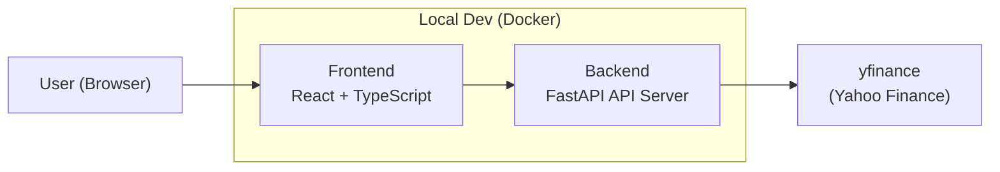
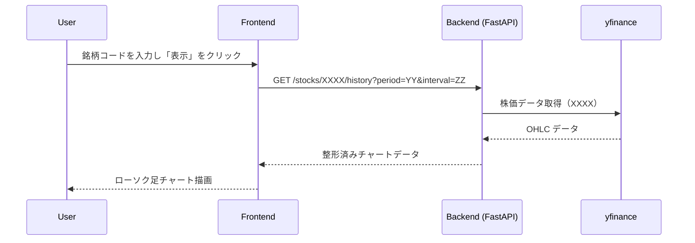

# 株価ビューワ Web アプリ アーキテクチャ

## 1. システム概要

本プロジェクトは、ブラウザ上で動作する株価ビューア Web アプリです。

ユーザーが銘柄コードを入力すると、サーバー側で yfinance を用いて株価データを取得し、  
フロントエンドでローソク足チャートとして可視化します。

将来的には GCP（Cloud Run）上にデプロイし、  
「クラウド × API主体 × フロントエンド」のスキルを示すポートフォリオとすることを目的とします。

※ 本アプリはポートフォリオ用途であり、商用サービスではありません。
株価データ取得には yfinance を用いていますが、Yahoo! Finance データの商用利用は禁止されているため、
本アプリは学習・デモ目的以外では利用しない想定です。

---

## 2. 要件とゴール

### 2-1. 機能要件（実装済の内容まで(手順3)）

- 銘柄コードの入力・検索  
- 指定銘柄の株価データ取得（yfinance 利用）  
- ローソク足チャートの表示（lightweight-charts）

### 2-2. 機能要件（今後の予定）

- ユーザー認証（まずはダミー認証 → 自前 JWT → Firebase Auth の流れを検討)
- お気に入り銘柄の登録・一覧表示  
- ユーザーごとのお気に入り状態の保存

### 2-3. 非機能要件

- GCP Cloud Run 上で動作する構成  
- 少ない運用コスト（サーバーレス構成）  
- Docker を前提としたローカル開発環境  
- ポートフォリオとして読みやすく、設計が伝わるドキュメント構成

---

## 3. 全体アーキテクチャ

### 3-1. コンポーネント一覧

- **Frontend（React + TypeScript）**  
  - ユーザー操作入力  
  - 銘柄検索  
  - チャート表示  
  - 今後：認証・認証状態管理・お気に入りUI

- **Backend（FastAPI）**  
  - API 提供（/health, /stocks）  
  - yfinance を利用した外部データ取得  
  - データ整形（OHLC 形式）  
  - 今後：認証・お気に入り管理

- **External API**  
  - yfinance（Yahoo Finance データ取得ライブラリ）

- **Infrastructure（開発環境）**  
  - Docker / docker-compose  
  - Colima（Apple Silicon Docker 仮想化）

### 3-2. コンポーネント図 (開発段階の内容)



---

## 4. バックエンド（FastAPI）

### 4-1. 役割

- フロントエンドから API リクエストを受け取る  
- yfinance を使って株価データを取得  
- チャート表示に必要なデータ形式に整形  
- JSON としてフロントエンドへ返却  
- 将来的に認証・お気に入り管理を担当

### 4-2. 主なエンドポイント（手順3時点）

---

#### **GET /health**

用途：動作確認用ヘルスチェック

```json
{ "status": "ok" }
```

---

#### **GET /stocks/XXXX/history?period=YY&interval=ZZ**

用途：指定された銘柄コードの株価データを取得する。

XXXX: 銘柄コード(例: AAPL, 9432.T)

| パラメータ    | 意味   | 例                          | 備考                        |
| -------- | ---- | -------------------------- | ------------------------- |
| period   | 取得期間 | 10d / 1mo / 1y / ytd / max | yfinance の period パラメータ   |
| interval | 足の間隔 | 1m / 1h / 1d / 1wk         | yfinance の interval パラメータ |


YY, ZZについて指定できるパラメータの[参考](https://ranaroussi.github.io/yfinance/reference/yfinance.price_history.html)

**レスポンス例（ローソク足 OHLC）**

```json
[
  {
    "date": "2025-11-18",
    "open": 269.989990234375,
    "high": 270.7099914550781,
    "low": 265.32000732421875,
    "close": 267.44000244140625,
    "volume": 45677300
  }
]
```

---

### 4-3. ディレクトリ構成

```
backend/
  main.py
  routers/
    stocks.py
  services/
    stocks_service.py
  schemas/
    stocks.py
  requirements.txt
infra/
  docker-compose.dev.yml
  Dockerfile.dev
```

---

## 5. フロントエンド（React + TypeScript）

### 5-1. 役割

- ユーザーが検索した銘柄をバックエンドに送信  
- 取得した株価データを Lightweight Charts で表示
- 今後の実装、認証 UI・お気に入り銘柄一覧

### 5-2. 画面構成（手順3）
- `/login`
  - 認証 UI（現在、フロント実装のみのダミーユーザーでログイン可能）

- `/`  
  - 検索フォーム  
  - チャート表示エリア


### 5-3. 主なコンポーネント構成

```
frontend/src/
  App.tsx
  pages/
    Home.tsx
    Login.tsx
  components/
    ProtectedRoute.tsx
    home/
      StockSearchForm.tsx
      StockChart.tsx
      FavoriteList.tsx
  types/
    stocks.ts
```

---

## 6. インフラ構成（開発環境 / 将来）

### 6-1. 開発環境（現在）

- macOS + Colima  
- Docker / docker-compose.dev.yml により  
  - バックエンド  
  - フロントエンド  
  をコンテナ上で実行

### 6-2. 将来の本番構成（手順5以降）

- Backend → Cloud Run  
- Frontend → Cloud Run または Cloud Storage  
- Artifact Registry でコンテナ管理  
- Secret Manager 等の活用も検討

---

## 7. 認証・認可（現状と今後）

### 現状（手順3）
- 認証は未実装
- フロントエンドのみのダミーユーザーあり
- フロントエンドのみの認証ガード実装済

### 今後（手順4）
- ダミーユーザー を用いた認証の仮実装   
- お気に入り機能 `/favorites` の追加

### 将来
- 自前 JWT  
- Firebase Auth などのマネージド認証へ移行可能な構成に

---

## 8. データフロー（手順3時点）

### UC-1: 株価チャート閲覧



---

## 9. 技術的な工夫・トレードオフ

- **yfinance の採用**  
  → 手軽に株価データにアクセス可能
- **Cloud Run 前提の設計**  
  → スケールアウト、コスト最適化、コンテナベースのため
- **認証の段階的導入**  
  → 最初はダミー → 自前 JWT → マネージド認証に移行

---

## 10. 実装手順について
| 手順 | 内容             | 実装状況 |
| -- | -------------- | ---- |
| 1  | Docker 開発環境構築  | 完了   |
| 2  | FastAPI サーバの構築 | 完了   |
| 3  | チャート表示機能, フロントのガード認証（ProtectedRouteパターン）  | 完了   |
| 4  | 擬似認証 + お気に入り機能   | これから |
| 5  | 認証の強化, Cloud Run デプロイ | 予定   |

※ バックエンド側の認証ガードは FastAPI の Depends を利用し、
   「トークン検証 → ユーザー取得」を行う get_current_user() 関数を共通化する方針。
   この関数を各 API に適用することで、認可されたユーザーのみが
   お気に入り API にアクセスできる構成とする。

## 11. 今後の拡張予定

- 手順4：
  - バックエンドと連携した認証(ダミーユーザー)
  - バックエンドのガード認証
  - お気に入り API（GET/POST/DELETE）  
  - フロント側のお気に入り UI
- 手順5：
  - JWTによる認証の実装
  - JWT -> Firebase Authにする (本番想定の構成として検討)
  - Cloud Run デプロイ  
  - 本番相当環境での動作確認

