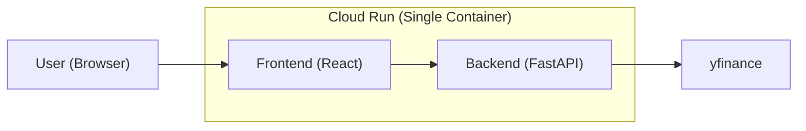
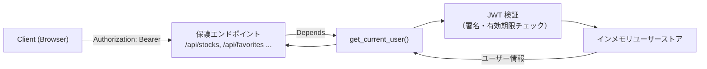
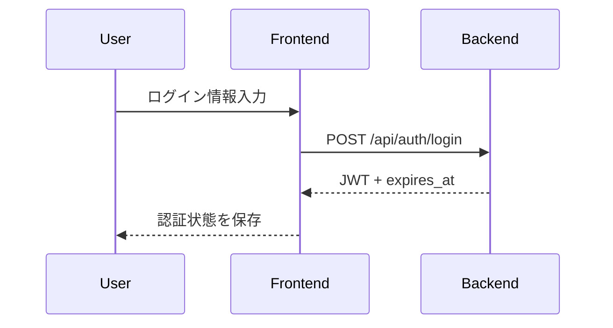
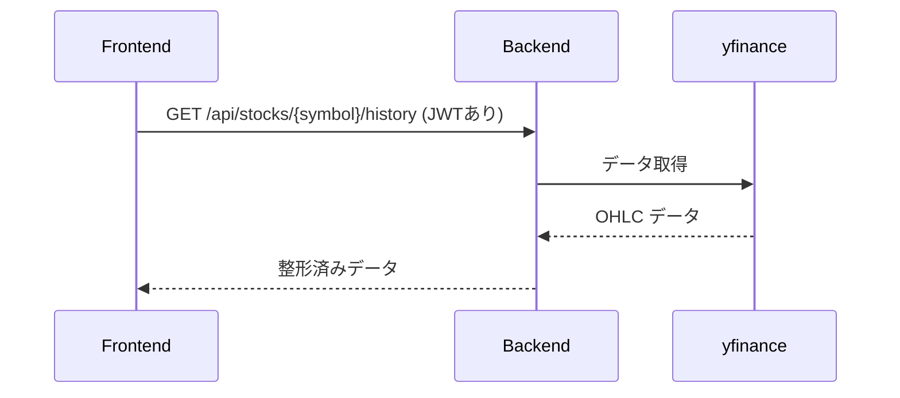

# 株価ビューワ Web アプリ アーキテクチャ

## 1. システム概要

本プロジェクトは、**React + FastAPI + GCP Cloud Run** を用いた株価ビューア Web アプリです。

ユーザーが銘柄コードを入力すると、サーバー側で yfinance を用いて株価データを取得し、  
フロントエンドでローソク足チャートとして可視化します。

本プロジェクトの目的は2つあります。
- 「クラウド × API主体 × フロントエンド」のスキルを示すポートフォリオ作成
- LLM（ChatGPT）を活用した一連の開発プロセスの経験
  - Docker による開発環境構築
  - API 設計
  - フロント実装
  - Cloud Run へのデプロイ

※ 商用利用は想定していません（Yahoo! Finance の規約により商用利用禁止）。

---

## 2. 要件とゴール

### 2-1. 機能要件（MVP / 実装済）

- 銘柄コードによる株価検索  
- yfinance による株価データ取得  
- Lightweight Charts によるローソク足描画  
- JWT 認証（インメモリユーザー + 自前 JWT）  
- お気に入り銘柄の登録・削除・一覧取得  
- 株価 API・お気に入り API は認証必須

### 2-2. 今後の予定（将来の拡張）

- Cloud Build を利用した CI/CD パイプライン構築
- Firebase Authentication への移行（マネージド認証）  
- Firestore / Cloud SQL などの永続 DB の採用検討  

### 2-3. 非機能要件

- Cloud Run 上でのサーバーレス運用  
- ローカル開発は Docker による dev container で統一  
- ポートフォリオとして理解しやすい構成とドキュメント性

---

## 3. 全体アーキテクチャ

### 3-1. コンポーネント

- **Frontend（React + TypeScript）**
  - UI（検索フォーム・チャート画面）
  - 認証 UI（ログイン）
  - 状態管理（認証トークン保持 / お気に入り一覧 / 選択中の銘柄）
  - チャート描画（lightweight-charts）

- **Backend（FastAPI）**
  - API 提供（/api/auth, /api/stocks, /api/favorites）
  - JWT 認証
  - 株価データ取得（yfinance）
  - データ整形（OHLC 形式）

- **External API**
  - yfinance（株価データの取得）

- **Cloud Run（デプロイ環境）**
  - フロントとバックエンドを単一コンテナ構成で提供
  - 静的ファイル配信 + API サーバ

- **Local Dev（Docker）**
  - backend / frontend をホットリロードで動作させる開発環境


### 3-2. アーキテクチャ図（Cloud Run 版）



---

## 4. バックエンド（FastAPI）

### 4-1. 役割

- 銘柄コードに応じて yfinance から株価データを取得  
- OHLC データに整形して返却  
- JWT を用いたユーザー認証（インメモリユーザー）  
- お気に入り銘柄の登録・取得（インメモリ辞書によるダミーDB）
- Stocks / Favorites の各 API の認証ガード


### 4-2. 主なエンドポイント

#### 認証が必要なエンドポイントでの共通ヘッダー

```http
Authorization: Bearer <JWTアクセストークン>
Content-Type: application/json
```

以下のエンドポイントは上記ヘッダーを前提とします：
- GET /api/stocks/{symbol}/history
- GET /api/favorites
- POST /api/favorites
- GET /api/auth/me

---

#### **GET /api/health**

用途：Cloud Run / ローカル動作確認
認証：不要

レスポンス例
```json
{ "status": "ok" }
```

---

#### GET /api/stocks/{symbol}/history  
用途：指定した銘柄コードの株価データ（OHLC）を取得する  
認証：必要  

パラメータ：

| パラメータ | 説明 | 例 | 備考 |
|-----------|------|-----|------|
| symbol | 銘柄コード | AAPL, 7203.T | 必須 |
| period | 取得期間 | 1mo, 1y, ytd | yfinance の仕様 |
| interval | 足の間隔 | 1d, 1wk | yfinance の仕様 |

パラメータの参考: [yfinanceの仕様](https://ranaroussi.github.io/yfinance/reference/yfinance.price_history.html)

レスポンス例：
```json
[
  {
    "date": "2025-11-18",
    "open": 270.0,
    "high": 271.0,
    "low": 265.3,
    "close": 267.4,
    "volume": 45677300
  }
]
```

---

#### GET /api/favorites  
用途：ログイン中のユーザーのお気に入り銘柄一覧を取得する  
認証：必要  

レスポンス例：
```json
{
  "user_id": "user1",
  "symbols": ["7203.T", "AAPL"]
}
```

---

#### POST /api/favorites  
用途：お気に入り銘柄の追加  
認証：必要  

リクエスト例：
```json
{ "symbol": "AAPL" }
```

レスポンス例：
```json
{
  "user_id": "user1",
  "symbols": ["AAPL", "7203.T"]
}
```

---

#### POST /api/auth/login  
用途：ログインし、JWT トークンを発行する  
認証：不要  

リクエスト例：
```json
{ "username": "user1" }
```

レスポンス例：
```json
{
  "access_token": "<jwt-string>",
  "token_type": "bearer",
  "expires_in_seconds": 3600
}
```

---

#### GET /api/auth/me  
用途：ログイン中のユーザー情報を確認する  
認証：必要  

レスポンス例：
```json
{
  "id": "user1",
  "name": "user1"
}
```

### 4-3. ディレクトリ構成

```text
backend/
  main.py
  routers/
  services/
  schemas/
  core/
  requirements.txt
```

---

## 5. フロントエンド（React + TypeScript）

### 5-1. 役割

- ユーザーが入力した銘柄コードをバックエンドへ送信し、レスポンスを UI として描画する  
- 株価データを lightweight-charts を用いてローソク足として可視化  
- 認証 UI（ログインフォーム）および認証状態の保持
- お気に入り銘柄リストの表示と操作（追加／削除）

### 5-2. 画面構成

- `/login`  
  - ログインフォーム（ユーザー名とパスワードの入力）  
  - バックエンドの `/api/auth/login` を呼び出し JWT を取得

- `/`（Home）  
  - 銘柄検索フォーム  
  - 株価チャート表示エリア  
  - お気に入り一覧の表示  
  - API へのアクセスは JWT 付与のクライアント経由で行う

### 5-3. 状態管理

- `AuthContext` による認証状態の管理  
  - auth_token の保持（localStorage）  
  - トークンの有効期限  
  - 未認証状態の判定および ProtectedRoute との連携

- UI 状態  
  - 検索中フラグ・エラー状態  
  - 選択中の銘柄  
  - 表示中のチャートデータ  
  - お気に入りリスト（API から取得）

### 5-4. 主なコンポーネント構成

```text
frontend/src/
  App.tsx
  pages/
    Home.tsx
    Login.tsx
  api/
    client.ts           # JWT付与の共通クライアント
    auth.ts
    favorites.ts
    stocks.ts 
  components/
    ProtectedRoute.tsx  # ログイン必須ページの保護
    home/
      StockSearchForm.tsx
      StockChart.tsx
      FavoriteList.tsx
  hooks/
    useStockViewer.ts   # 検索・お気に入りなどのロジック集約
  context/
    AuthContext.tsx     # 認証状態の保持
  types/
    stocks.ts
```

---

## 6. インフラ構成

### 6-1. ローカル開発環境

- Docker / docker-compose.dev.yml  
- Colima（Apple Silicon 仮想化）  
- backend と frontend をそれぞれ別コンテナとして起動
  - backend（FastAPI）: ホットリロード（uvicorn --reload）
  - frontend（React + Vite）: ホットリロード（vite dev）
- コンテナ間は docker-compose のネットワークで疎通

※ 開発時は更新頻度が高いため、フロントとバックを独立したホットリロードコンテナとして運用。
   本番は単一コンテナに統合（Cloud Run）。


### 6-2. Cloud Run（リモート環境）

- **prod（公開用 Cloud Run）**  
- **dev（開発用 Cloud Run）**

**Cloud Run のインスタンス設定**
- 最小インスタンス数：1
  - コールドスタート防止
  - ポートフォリオ閲覧時の応答速度確保
- 最大インスタンス数：デフォルト値(100)

Cloud Run 上では、フロントエンドとバックエンドを単一コンテナ構成で提供

**Cloud Run内でのルーティング**
- `/api/*` → FastAPI  
- `/static/*` → フロントのビルドファイル 
- その他(`/login`, `/`)：SPA 用の index.html を返却（フロント側ルーティングの入口）

**SPA 配信の仕組み**
- React のビルドファイルは frontend/dist に生成
- FastAPI が StaticFiles を用いて dist/ を静的配信
- フロント側のルーティング（React Router）はすべて index.html を起点として動作するため、定義されていない URL も index.html にフォールバックする

---

## 7. 認証と依存関係

本章では、本アプリにおける JWT 認証の設計と、FastAPI の Depends を用いた認証依存関係の仕組みについて整理します。

### 7-1. 認証フローの概要

※ MVP のため、ユーザーパスワードや永続 DB は未導入（PoC の認証として簡易実装）。

- `/api/auth/login`  
  - ユーザー名を受け取り JWT を発行
- `/api/auth/me`  
  - 現在ログイン中のユーザーを返す
- 認証が必要な API  
  - `/api/stocks/{symbol}/history`
  - `/api/favorites` (GET/POST)
  - これらは全て `get_current_user` による JWT チェックを通過する必要がある

### 7-2. 依存関係（FastAPI Depends）概要

保護エンドポイントでは、以下のように `Depends(get_current_user)` を使用します：

```python
@router.get("/api/favorites")
def list_favorites(current_user: User = Depends(get_current_user)):
    return favorites_service.get_favorites(user_id=current_user.id)
```

- `current_user` は `get_current_user()` により解決される
- JWT が無効 / 期限切れ / 不正な場合は自動的に 401 が返される

### 7-3. 認証依存関係の図



### 7-4. 認証方式のポイント

- **インメモリユーザー**  
  - 辞書型の簡易ストアを使用  
  - データ永続化は行わない（MVP 用途）

- **JWT（自前実装）**  
  - HS256 による署名  
  - `exp` で有効期限を管理  
  - 認証ガードは `get_current_user` が一元的に担当

- **フロント側の認証状態管理**  
  - `AuthContext` によるトークン管理  
  - localStorage に `auth_token / auth_expires_at` を保存  
  - ProtectedRoute により未認証時は `/login` へリダイレクト

### 7-5. 今後の拡張（認証）

- Firebase Authentication への移行（マネージド認証）  
- ユーザーデータを永続ストア（Firestore / Cloud SQL）に移行  
- Refresh Token による再認証  

---

## 8. データフロー

### ログイン



---

### 株価閲覧



---

## 9. 技術的トレードオフ / 工夫点

- **yfinance の採用**
  → 非公式だが学習目的では十分。高速に株価データを取得可能。

- **Cloud Run の採用**
  → スケール・コスト最適化。コンテナベースでデプロイ容易。

- **自作 JWT 認証**
  → Firebase Auth 導入前段階として、JWT の仕組み理解を目的に実装。

- **単一コンテナ（フロント + API）構成**
  → Cloud Run と相性が良い。サービス分割よりシンプルでポートフォリオ向き。

---

## 10. 実装手順のハイレベルまとめ

詳細は `docs/dev-log.md` に記載。

- Docker 開発環境構築  
- 最小 API（FastAPI）  
- チャート＆ダミー認証  
- JWT 認証 + お気に入り機能  
- Cloud Run デプロイに向けた構成調整

---

## 11. 今後の拡張 (簡易)

- Cloud Build による CI/CD  
- Firebase Auth への移行  
- 永続 DB（Firestore / Cloud SQL）  


