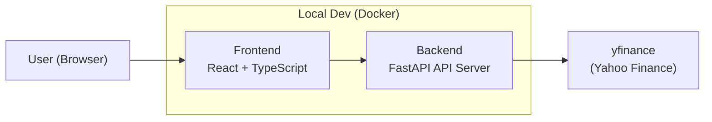
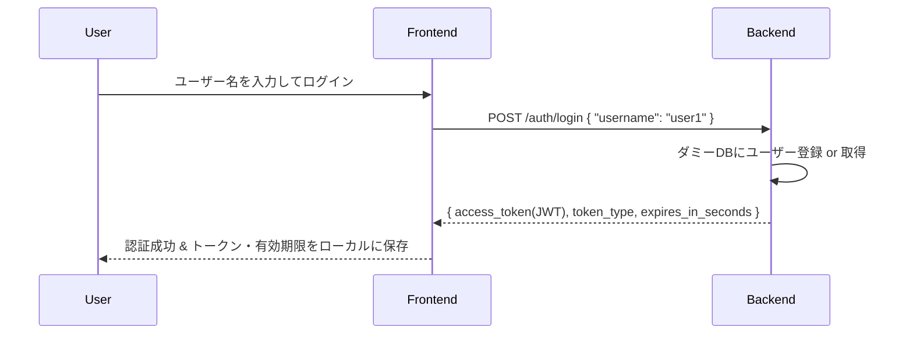
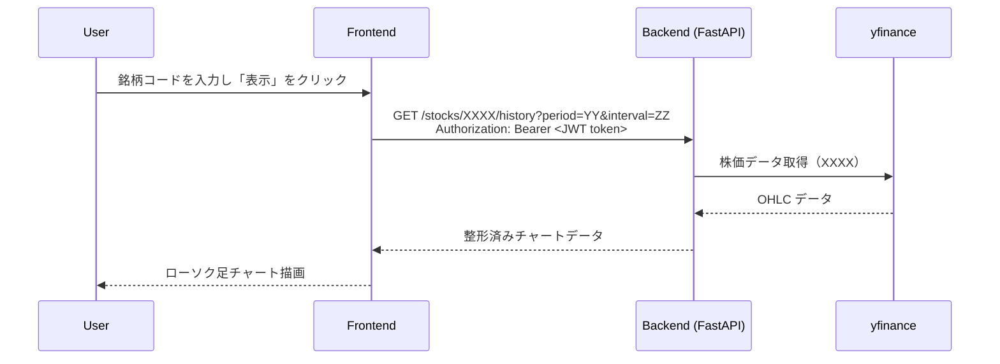
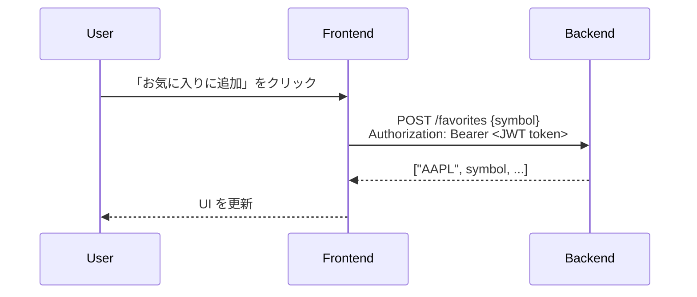
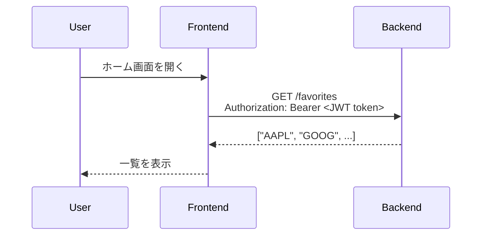
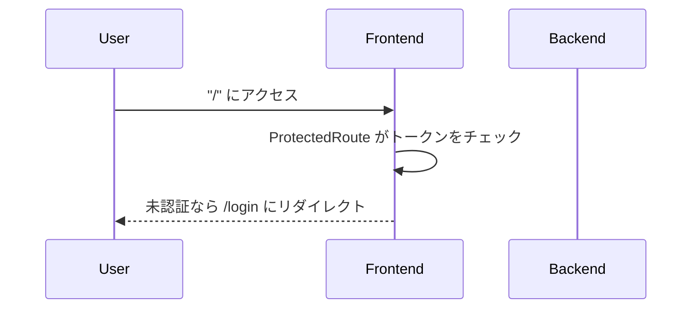

# 株価ビューワ Web アプリ アーキテクチャ

## 1. システム概要

本プロジェクトは、ブラウザ上で動作する株価ビューア Web アプリです。

ユーザーが銘柄コードを入力すると、サーバー側で yfinance を用いて株価データを取得し、  
フロントエンドでローソク足チャートとして可視化します。

将来的には GCP（Cloud Run）上にデプロイし、  
「クラウド × API主体 × フロントエンド」のスキルを示すポートフォリオとすることを目的とします。

※ 本アプリはポートフォリオ用途であり、商用サービスではありません。
株価データ取得には yfinance を用いていますが、Yahoo! Finance データの商用利用は禁止されているため、
本アプリは学習・デモ目的以外では利用しない想定です。

---

## 2. 要件とゴール

### 2-1. 機能要件（実装済の内容まで）

- 銘柄コードの入力・検索  
- 指定銘柄の株価データ取得（yfinance 利用）  
- ローソク足チャートの表示（lightweight-charts）
- ユーザー認証（インメモリのダミーユーザー + 自前 JWT）
- お気に入り銘柄の登録・一覧表示
- 株価取得、お気に入り機能の利用には認証が必要

### 2-2. 機能要件（今後の予定）

- ユーザー認証（自前 JWT 認証済み → Firebase Auth 等のマネージド認証への移行を検討）
- ユーザー登録（本格運用を想定した永続化ストレージでの管理を検討中）

### 2-3. 非機能要件

- GCP Cloud Run 上で動作する構成  
- 少ない運用コスト（サーバーレス構成）  
- Docker を前提としたローカル開発環境  
- ポートフォリオとして読みやすく、設計が伝わるドキュメント構成

---

## 3. 全体アーキテクチャ

### 3-1. コンポーネント一覧

- **Frontend（React + TypeScript）**  
  - ユーザー操作入力  
  - 銘柄検索  
  - チャート表示  
  - 認証・認証状態管理
  - お気に入りUI

- **Backend（FastAPI）**  
  - API 提供（/health, /stocks）  
  - yfinance を利用した外部データ取得  
  - データ整形（OHLC 形式）  
  - 認証（インメモリのダミーユーザーに対する JWT 発行・検証）
  - お気に入り管理
  - 今後: Firebase Auth など外部認証基盤への移行を検討

- **External API**  
  - yfinance（Yahoo Finance データ取得ライブラリ）

- **Infrastructure（開発環境）**  
  - Docker / docker-compose  
  - Colima（Apple Silicon Docker 仮想化）

### 3-2. コンポーネント図 (開発段階の内容)



---

## 4. バックエンド（FastAPI）

### 4-1. 役割

- フロントエンドから API リクエストを受け取る  
- yfinance を使って株価データを取得  
- チャート表示に必要なデータ形式に整形  
- JSON としてフロントエンドへ返却
- 認証機能: インメモリのユーザーに対する JWT の発行・検証
  - 現在は辞書型変数によるダミーDBでユーザー管理
- お気に入り管理（辞書型変数によるダミーDB）
- Stocks API, Favorites API を JWT で保護
  - get_current_userがデータ取得APIの前に走ることで認証ガードを実現


### 4-2. 主なエンドポイント

---

#### **GET /health**

用途：動作確認用ヘルスチェック

```json
{ "status": "ok" }
```

---

#### **GET /stocks/XXXX/history?period=YY&interval=ZZ**

用途：指定された銘柄コードの株価データを取得する。

XXXX: 銘柄コード(例: AAPL, 9432.T)

| パラメータ    | 意味   | 例                          | 備考                        |
| -------- | ---- | -------------------------- | ------------------------- |
| period   | 取得期間 | 10d / 1mo / 1y / ytd / max | yfinance の period パラメータ   |
| interval | 足の間隔 | 1m / 1h / 1d / 1wk         | yfinance の interval パラメータ |


YY, ZZについて指定できるパラメータの[参考](https://ranaroussi.github.io/yfinance/reference/yfinance.price_history.html)

**レスポンス例（ローソク足 OHLC）**

```json
[
  {
    "date": "2025-11-18",
    "open": 269.989990234375,
    "high": 270.7099914550781,
    "low": 265.32000732421875,
    "close": 267.44000244140625,
    "volume": 45677300
  }
]
```

#### **GET /favorites**
用途: ログイン中のユーザーのお気に入り銘柄一覧を取得する。

**Header**
```http
Authorization: Bearer <token>
Content-Type: application/json
```

**レスポンス例**
```json
{
  "user_id": "user1",
  "symbols": [
    "7203.T",
    "AAPL"
  ]
}
```

---

### 4-3. ディレクトリ構成

```
backend/
  main.py
  routers/
    stocks.py
    auth.py
    favorites.py
  services/
    stocks_service.py
    auth_service.py
    favorites_service.py
  schemas/
    stocks.py
    auth.py
    favorites.py
    user.py
  requirements.txt
infra/
  docker-compose.dev.yml
  Dockerfile.dev
```

---

## 5. フロントエンド（React + TypeScript）

### 5-1. 役割

- ユーザーが検索した銘柄をバックエンドに送信  
- 取得した株価データを Lightweight Charts で表示
- 認証 UI
- お気に入り銘柄一覧

### 5-2. 画面構成
- `/login`
  - 認証 UI

- `/`  
  - 検索フォーム  
  - チャート表示エリア


### 5-3. 主なコンポーネント構成

```
frontend/src/
  App.tsx
  pages/
    Home.tsx
    Login.tsx
  api/
    client.ts
    auth.ts
    favorites.ts
    stocks.ts 
  components/
    ProtectedRoute.tsx
    home/
      StockSearchForm.tsx
      StockChart.tsx
      FavoriteList.tsx
  hooks/
    useStockViewer.ts
  context/
    AuthContext.tsx
  types/
    stocks.ts
```

---

## 6. インフラ構成（開発環境 / 将来）

### 6-1. 開発環境（現在）

- macOS + Colima  
- Docker / docker-compose.dev.yml により  
  - バックエンド  
  - フロントエンド  
  をコンテナ上で実行

### 6-2. 将来の本番構成（手順5以降）

- Backend → Cloud Run  
- Frontend → Cloud Run または Cloud Storage  
- Artifact Registry でコンテナ管理  
- Secret Manager 等の活用も検討

---

## 7. 認証・認可（現状と今後）

### 現状

- バックエンド
  - インメモリのダミーユーザーを管理（実データベースは未使用）
  - `POST /auth/login`
    - `username` を受け取り、存在しなければダミーDBにユーザー登録
    - ユーザーIDを `sub` として含む JWT アクセストークンを発行
    - 有効期限は `.env` の `JWT_EXPIRE_MINUTES` で管理
    - レスポンス例（概略）  
      ```json
      {
        "access_token": "<jwt-token-string>",
        "token_type": "bearer",
        "expires_in_seconds": 3600
      }
      ```
  - `get_current_user`（認証ガード）
    - すべての保護 API で使用する共通 Depends
    - `Authorization: Bearer <JWT>` を検証し、不正または期限切れなら 401 を返却

  - JWT で保護されるエンドポイント：
    - `GET /auth/me`
    - `GET /favorites`
    - `POST /favorites`
    - `GET /stocks/{symbol}/history`
    - `GET /stocks/search`
    - → Stocks API も含め、ユーザー固有のデータアクセス全てが保護対象となった

- フロントエンド
  - `POST /auth/login` を呼び出し、`access_token` と `expires_in_seconds` を受け取る
  - `AuthContext` が以下を管理
    - `auth_token`（localStorage に保存）
    - `auth_expires_at`（期限をミリ秒で保存）
    - 有効期限切れの場合は自動的に未ログイン扱い
  - API 呼び出し時は `api/client.ts` を通じて自動的にヘッダ付与：
    ```http
    Authorization: Bearer <access_token>
    ```
  - `ProtectedRoute` が認証状態を参照し、未認証時は `/login` へリダイレクト

### 今後

- Firebase Auth などのマネージド認証サービスへ移行を検討
  - ユーザー登録・ログイン・セキュリティ管理を外部に委譲
  - バックエンド側は「Firebase の ID Token を検証して認可する API」へシンプル化
- お気に入り情報やユーザー情報の永続化（RDB / NoSQL など）を検討
- Cloud Run での本番運用向け構成の整備

---

## 8. データフロー
### UC-1: ログイン（自前 JWT 認証）



### UC-2: 株価チャート閲覧

※ フロントエンドは事前に /auth/login で取得した JWT を Authorization ヘッダに付与して Stocks API にアクセスする。



### UC-3: お気に入りの追加
※ フロントエンドは事前に /auth/login で取得した JWT を Authorization ヘッダに付与して Favorites API にアクセスする。



### UC-4: お気に入り一覧の取得
※ フロントエンドは事前に /auth/login で取得した JWT を Authorization ヘッダに付与して Favorites API にアクセスする。



### UC-5: 認証ガードによる保護された画面へのアクセス


---

## 9. 技術的な工夫・トレードオフ

- **yfinance の採用**  
  → Yahoo!Financeの非公式であるため不安定だが、手軽に株価データにアクセス可能
- **Cloud Run 前提の設計**  
  → スケールアウト、コスト最適化、コンテナベースのため
- **認証の段階的導入**  
  → 最初はダミー → 自前 JWT → マネージド認証に移行

---

## 10. 実装手順について
| 手順 | 内容             | 実装状況 |
| -- | -------------- | ---- |
| 1  | Docker 開発環境構築  | 完了   |
| 2  | FastAPI サーバの構築 | 完了   |
| 3  | チャート表示機能, フロントのガード認証（ProtectedRouteパターン）  | 完了   |
| 4  | 自前JWTを用いた擬似認証 + お気に入り機能(インメモリDB)   | 完了 |
| 5  | 認証のマネージド化(Firebase Auth 等), Cloud Run デプロイ | これから   |

※ 認証の強化はダミートークンをJWTに変更、そして、Firebase Authを利用する予定

## 11. 今後の拡張予定

- 手順5：
  - JWT -> Firebase Authにする (本番想定の構成として検討)
  - Cloud Run デプロイ  
  - 本番相当環境での動作確認


